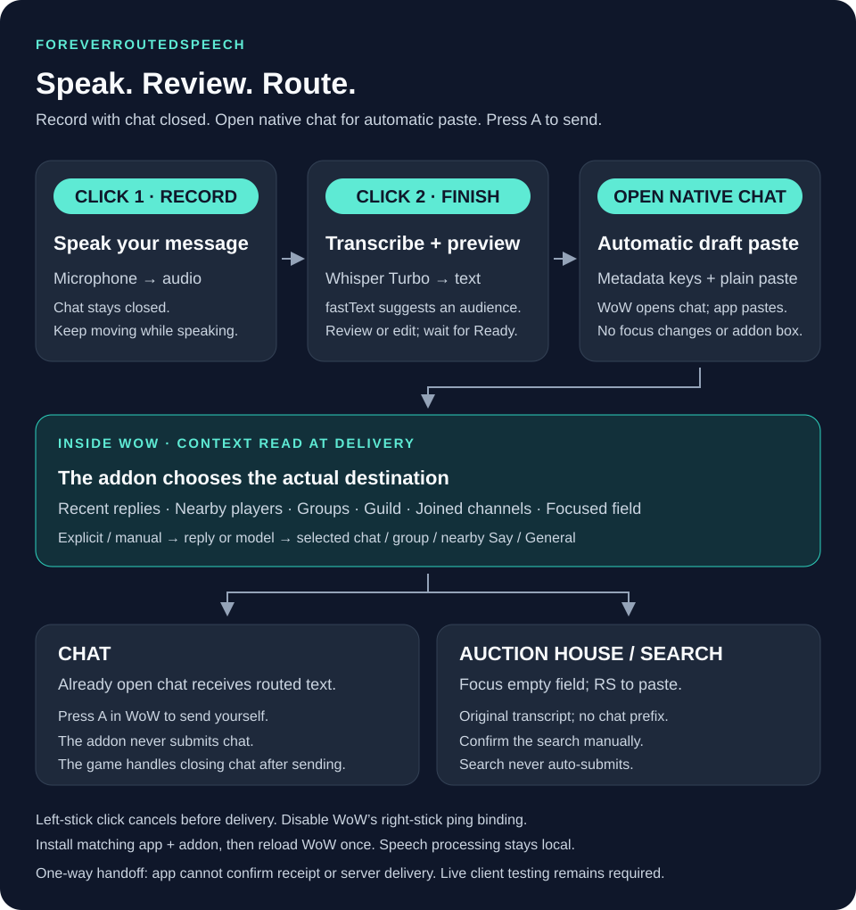

# ForeverRoutedSpeech

A fork of [samsbase/SpeakForever](https://github.com/samsbase/SpeakForever), adding local audience routing to controller speech-to-chat. The upstream Windows/controller foundation, MIT attribution and Git history are preserved. This is an independent fork.

## Current build versus public download

**Current source uses addon-side routing with no visible status strip, screen capture, calibration or context verification commands.** The public [Preview 2 download](https://github.com/ryeceps/ForeverRoutedSpeech/releases/tag/v0.2.0-preview.1) predates this redesign. Do not combine that older app with the new addon. The current local development build and installed addon are updated together; a new public archive has not yet been published.

The Windows x64 app uses Whisper **Turbo q5_0 only**, with Vulkan where available and CPU fallback. Speech and classification stay local; no API key or model picker. Normal operation is offline. Model/native dependencies and checksums are pinned. No audio or transcript history is retained by the app.

## Controller flow

1. Click the right stick to start recording. Keep moving with chat closed.
2. Click it again to stop and transcribe. Wait for the editable draft preview.
3. Click it when Ready to deliver the draft to the addon. The addon reads current context and opens the native chat draft, or fills an already focused empty text/search field.
4. With auto-send **off**, press the game's A/send control to send chat. With **Auto-send on final stick click** enabled in Settings, the addon checks the routed draft and requests chat send once. Search confirmation is always manual.

Left-stick click cancels before delivery. It cannot retract a sent message. Disable WoW's controller ping binding for right-stick click, otherwise each dictation click can ping.

The addon creates no visible box. The companion's optional overlay remains configurable. Updating addon files requires one normal WoW UI reload or relog; there are no calibration or prefix/limit setup commands.

## How the whole stack works



The native chat header shows the final audience; the companion preview shows a suggestion. Install the matching app and addon, then reload WoW once.

### What happens behind the scenes

- The **Windows app** watches the controller and microphone. Whisper Turbo turns audio into text; WoW vocabulary hints help recognition, but real pronunciation accuracy still needs speech testing.
- **fastText** suggests an audience from message text alone. It no longer receives invented group/guild/channel context. Guild suggestions require address language and the tuned score/margin. Inferred public routing stays disabled because the authored bootstrap is too small to certify the production precision target.
- The companion shows the original message and suggested audience, and copies human-readable text. It does not claim to know the game's final destination.
- On the final physical click, the app temporarily copies a versioned draft packet and requests the addon's internal `Ctrl+Shift+F10` inbox shortcut, followed by one paste. The inbox is an invisible 1 × 1 EditBox, not a pixel signal. Clipboard ownership, foreground game process and modifier checks guard external input. Partial input is never retried.
- The inbox waits for 100 ms without text changes before validating, so a paste arriving in several callbacks is not rejected halfway through. The delivery packet stays on the clipboard until the next deliberate copy; queued Windows input does not prove WoW has read it. The next prepared draft copies readable text again.
- The **addon** validates packet version, UTF-8 byte length, checksum, recent duplicate ID and expiry. It gathers party/raid/instance, guild, joined channel IDs/names and location locally at delivery time. No game context leaves WoW.
- It removes only a recognized spoken routing instruction, resolves the destination, then fills native chat. The native chat header shows the actual final audience. Search fields receive the original plain transcript, without routing metadata or chat prefixes.
- Optional auto-send invokes the native chat edit box's Enter handler once after checking destination, complete text and focus. Client rejection leaves a draft for manual sending. An empty chat edit box is closed; unsent text is never discarded. The companion cannot observe an acknowledgement or guarantee server delivery.

The internal shortcut is assigned by the addon; users do not map an extra controller button. If the addon is missing, its binding API is unsupported, or the invisible inbox cannot take focus, delivery cannot be guaranteed. The app has no reverse acknowledgement channel. Native focus, shortcut and protected-send behavior must be checked on the Forever client; unit tests do not establish live compatibility.

## Routing examples

| Speech / live situation | Final addon result |
| --- | --- |
| Solo: `Hey guys` | Say |
| Party: `Hey guys` | Party |
| Instance group / Raid | Instance first, then Raid, then Party |
| `In General, anyone need a tank?` | Currently joined General ID, with the instruction removed |
| `Ask in trade selling potions` | Currently joined Trade ID; never hardcoded to `/2` |
| `Tell guild hello` | Guild if available; otherwise refuse |
| `Tell everyone around me we need help` | Say even while grouped |
| `In Officers, meeting tonight` | Joined custom channel by explicit name |
| Auction House/search already focused | Plain transcript; never auto-submit |

Explicit requests and manual corrections take priority, followed by qualified model suggestions, an already open supported chat audience, group defaults, a retained solo chat audience and Say. Merely mentioning an item or guild is insufficient. Unavailable explicit channels refuse delivery rather than silently changing the audience.

Messages are capped at **200 UTF-8 bytes**. The addon also checks the target edit box's exposed limits and confirms complete text after setting it. Oversized messages require editing; they are not truncated. Existing text, unsupported targets, damaged packets and unavailable APIs refuse delivery. No automatic retraining happens during play.

## Build and installation

Use this fork's scripts, rather than the retained upstream build scripts:

```powershell
./scripts/Setup-Tools.ps1
./scripts/Build.ps1
./scripts/Install-Addon.ps1 -AddOnsDirectory 'C:/Program Files (x86)/World of Warcraft/_classic_beta_/Interface/AddOns' -Interface 16001
```

Use the actual client's AddOns directory and Interface number; 16001 is the observed beta value, not a promise for future builds. The installer removes the legacy renderer and preview, and replaces the old bindings file with an empty loader compatibility file. Reload WoW once after installation. If updating a running client produces a missing-file warning, fully restart WoW to refresh its addon file list. The portable package includes the .NET runtime, native libraries, pinned Turbo model, classifier and VC runtime prerequisite; normal operation needs no separate model download.

[Stack and tests](docs/ADDON-ROUTING.md) explain the implementation and its limits. [Controller acceptance checks](docs/CONTROLLER-TEST.md) cover live testing. [Test results](docs/TEST-RESULTS.md) distinguish mock/native tests from actual client evidence. [Policy notes](docs/POLICY.md) retain the prior review; this redesign is not a claim of Blizzard approval.

Forked from upstream commit `41f212558f4e9ba378ec44e9e6b9e44177b6a7be`. Upstream C# namespaces/project names remain where useful. Upstream auto-updates are disabled. This source is experimental and unsigned; the current live shortcut/inbox/send path has not been verified by computer automation.
