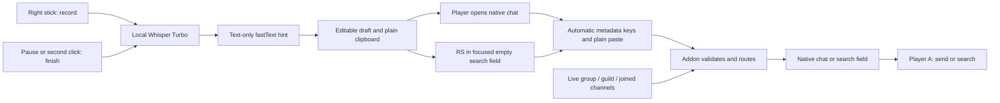

# Native field routing, no addon focus changes

The companion produces speech text and intent hints. The addon reads live context inside WoW. There is no status strip, screen capture, hidden EditBox, reverse context feed or calibration.



## Controller trigger

The companion observes the same native open-chat chord that WoW sees (default LB + RB + Down), or selection of Chat from the native radial menu. If a draft is already ready, that deliberate action requests one paste automatically. It does not open chat itself. Returning from chat menus, pressing Send, movement and transcription completion do not trigger delivery. Opening a radial menu preserves a ready draft. Opening chat before transcription finishes does not queue a future paste; use RS once ready instead.

A ready draft can also be pasted with RS into a field the player has already focused. LS cancels before paste. Once a native draft exists, use WoW's Back control to dismiss it; LS does not operate native focus. Submission and normal chat closing belong to the game's A action.

## Control signal and plain clipboard

`AddonControl` encodes ASCII metadata: `frs2 <32-hex nonce> <hint> <UTF8 byte count> <8-hex Adler32>`. The checksum covers the header plus the original speech. Hints distinguish inferred (`i:guild`) from manual (`m:guild`, `m:channel:7`) routes. There is no send flag or executable command.

The companion holds Ctrl + Alt + Shift for a short internal function-key sequence. F17 begins, F1 through F16 encode hexadecimal nibbles, F18 commits, and F19 cancels. Only metadata travels this way; the clipboard remains the original plain transcript throughout. The addon assigns its internal bindings automatically and observes focused edit-box key events. These shortcuts and actual client dispatch still require Forever acceptance testing.

`AddonDeliveryWorkflow` waits 120 ms before the control signal when native chat is opening, then another 120 ms before paste. It checks foreground game, clipboard ownership and modifiers before each input step. Cancellation during the initial wait causes no input. Partial Windows input never retries. The waits allow event processing; they are not receipt acknowledgements.

## Focus-preserving adapter

`Inbox.lua` retains its filename for packaging compatibility, but creates no EditBox. It snapshots the already shown, unrestricted focused native field, validates the metadata frame, and waits for 100 ms without text changes after plain paste. Transactions expire after three seconds; up to 128 recent nonces prevent replay.

The addon never invokes native open, focus, clear-focus, hide, Enter or Send handlers. It exposes no addon slash commands because Forever's native cleanup after addon slash callbacks can also taint gamepad focus. It changes only the accepted chat destination/header and exact validated body. Ordinary typing and unrelated pastes remain untouched when no transaction is armed.

An occupied field is restored to its original text only if the exact checksummed incoming body can be identified. Corruption, changed focus, cancellation and restricted controls refuse routing. The companion caps speech at 200 UTF-8 bytes. A native field may truncate paste to its own smaller cap; the adapter reports the mismatch and does not mark it ready or submit. It does not change native field limits or silently reconstruct missing characters.

## Live resolution

At delivery, Lua reads group/guild availability, joined channel IDs/names, zone/subzone, city-map/capital and resting status. Being in a city alone does not imply public intent. Explicit routing instructions and manual corrections outrank qualified model hints. Unavailable inferred hints fall back; unavailable explicit/manual requests refuse. A newly opened Say field allows ordinary speech to use Instance → Raid → Party → Say. An already selected supported Guild or numbered channel is retained unless overridden.

General and Trade use current joined IDs, never fixed 1/2 assumptions. Custom channels support explicit names and manual numbers, not inferred intent. Search receives the complete original transcript without stripping audience phrases. The native chat header is the audience indicator; the companion preview remains a suggestion.

## Evidence and limits

The user's client reported `SetPreferredGamepadInteractTarget()` as forbidden. Production-path Lua tests make native focus/open calls throw and prove the replacement never calls them. This demonstrates removal of that call chain in our implementation, not live client success or Blizzard approval. Destination/header changes and function-key transport still need a player check. A protected-action event stops routing and suppresses false readiness; no automatic retry or send occurs.

This is a one-way transport. The app reports a paste request, not verified receipt, routing or server delivery. If native bindings fail, ordinary speech remains on the clipboard. Review the actual native field before A. Missing addon support can leave plain speech, including spoken routing words, unprocessed.

## Regression checks

`tests/addon_local_routing_test.py` executes shipped Lua with native focus/open methods forbidden. It covers live channel renumbering, group transitions, explicit/custom/manual routes, occupied/search fields, fragmented paste, UTF-8/checksum mismatch, expiry, cancellation, restricted controls and protected-action refusal. Installer upgrade checks remove legacy rendering files and retain the empty Bindings.xml compatibility stub.

C# tests compare `AddonControl` to Lua-accepted fixtures and test native-open settling, cancellation before all input, guarded single paste and no Enter. Chat-panel tests distinguish explicit native opening from menu return and Send. Native smoke checks use the actual fastText model. Legacy pixel and `/frs1` packet fixtures are historical coverage, not current transport.

```powershell
python tests/addon_local_routing_test.py
python tests/training_test.py
dotnet run --project tests/SpeakForever.Core.Tests -c Release
dotnet run --project tests/VoiceRouter.Tests -c Release
dotnet run --project tests/Routing.Smoke -c Release -- dist/ForeverRoutedSpeech
```

Upgrade companion and addon together, then reload WoW once. The public Preview 2 archive predates this protocol.
