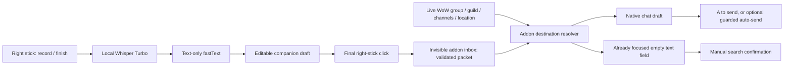

# One-way draft handoff, local game context

The old screen bridge is replaced in the default app/addon path. There is no visible addon box and no reverse context feed. The app produces text and intent hints; the addon owns live-context decisions.



## Transport

`AddonEnvelope` serializes `/frs1 <32-hex nonce> <hint> <send 0/1> <UTF8 byte count> <8-hex Adler32> <original message>`. Hints distinguish inferred (`i:guild`) from manual (`m:guild`, `m:channel:7`) requests. The transcript remains intact until Lua can resolve spoken explicit channel names against live joined channels. There is no executable Lua or arbitrary command in a packet.

The clipboard normally holds human-readable text. On delivery, `Session.DeliverToAddonAsync` replaces only its owned clipboard with a packet, invokes `Ctrl+Shift+F10`, waits 120 ms and requests one Ctrl+V. It restores readable clipboard text only if ownership still matches. `AddonDeliveryWorkflow` rechecks game/clipboard/modifiers before both actions; cancellation attempts the internal cancel shortcut and the addon also expires an unused inbox after three seconds. No external Enter is sent by this workflow.

The addon assigns its internal shortcuts through override click bindings. A transparent 1 × 1 EditBox takes keyboard focus only during delivery. The addon remembers the previously focused control and never pastes protocol metadata directly into its final target. Occupied or unsupported targets still consume/refuse the packet in the inbox, protecting existing text. It remembers up to 128 recent packet IDs in memory to reject duplicates; there is no retained transcript history.

## Local resolution

At receipt, Lua reads current group/guild availability, joined channel IDs/names, zone/subzone, city-map/capital status and resting status. Resting in an inn does not imply a city; being in a city does not automatically make speech public. Explicit audience instructions and manual corrections outrank model hints. Unavailable inferred hints fall back to current supported chat/group defaults; unavailable explicit/manual requests refuse instead. The addon preserves an already open supported chat audience, otherwise defaults Instance → Raid → Party → retained solo audience → Say.

Joined names and numbers are resolved at delivery. General/Trade are not hardcoded to 1/2. Custom channels have explicit names or manual numeric selection, never automatic inferred intent. Search/text fields bypass audience parsing and keep the complete transcript as plain text. The native chat header is the final audience indicator; the companion preview is a suggestion, not a live acknowledgement.

## Sending and failure limits

With auto-send off, Lua opens/populates native chat and leaves A to the user. With it on, Lua verifies the destination, channel target, entire message and focused edit box, then invokes that edit box's native Enter handler once. It never auto-submits a search. An absent/protected/ineffective Enter handler leaves the draft for manual send; it does not retry. Only an empty native chat box is hidden afterward.

This is a **one-way** handoff. The companion cannot verify that the addon received the shortcut, that its invisible edit box obtained focus, or that the server accepted a message. Missing addon/binding/focus support must be diagnosed on the client; the app reports a delivery request rather than a successful send. The current tests establish Lua/control-flow behavior, not Forever protected-input compatibility. The visible bridge could provide feedback; removing it trades that feedback for a simpler UI. Do not add a timed blind Enter as a substitute.

## Regression checks

`tests/addon_local_routing_test.py` runs the actual shipped Lua modules and inbox callbacks. It checks zero-alpha/non-rendered inbox, TOC exclusion of old renderer/preview, binding setup, explicit overrides, live channel renumbering, groups changing between preparation and delivery, inferred unavailable fallback, explicit unavailable refusal, custom/manual routes, current chat, unknown audience, occupied fields, Unicode/limits, partial packets, cancellation, expiry, duplicate IDs, search isolation and optional send/refusal.

`AddonDeliveryTests` checks C# packets against Lua-accepted fixtures, plain clipboard drafts without capture, invalid payloads, text-only intent features, Guild-address gating and the prepare/paste/cancel sequence. `tests/Routing.Smoke` uses the actual native fastText library/model. CI runs Lua and training checks plus C# suites. Legacy pixel tests/fixtures remain historical compatibility coverage and are not loaded by the addon.

```powershell
python tests/addon_local_routing_test.py
python tests/training_test.py
dotnet run --project tests/SpeakForever.Core.Tests -c Release
dotnet run --project tests/VoiceRouter.Tests -c Release
dotnet run --project tests/Routing.Smoke -c Release -- dist/ForeverRoutedSpeech
```

The public Preview 2 archive predates this protocol. Upgrade app and addon together. Installation needs one normal UI reload/relog, not calibration or SavedVariables verification.
